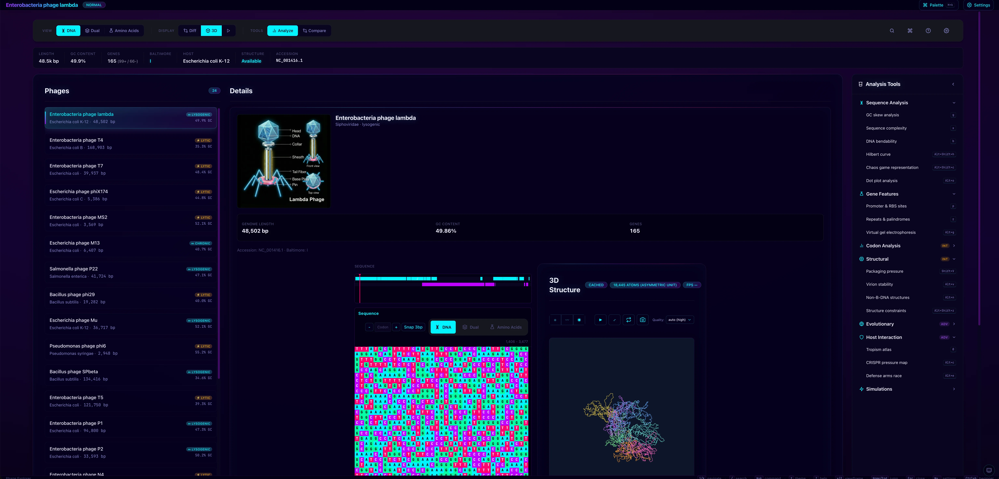
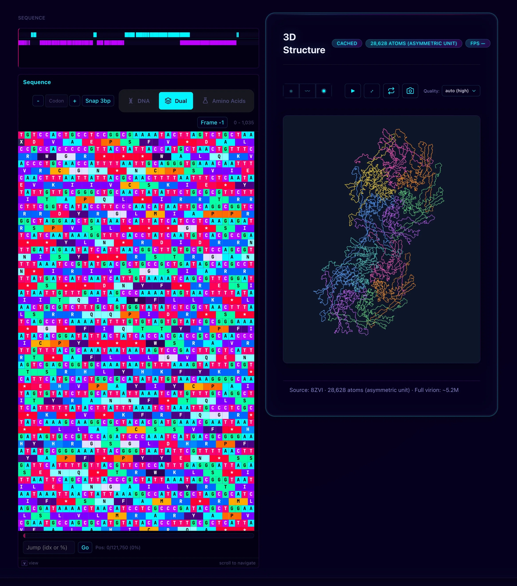
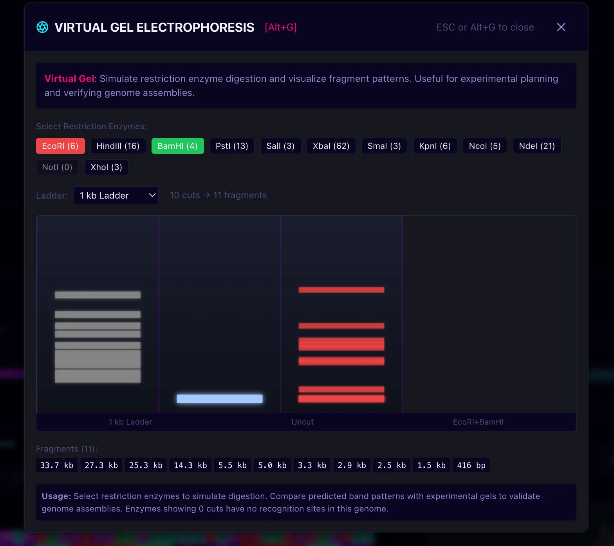
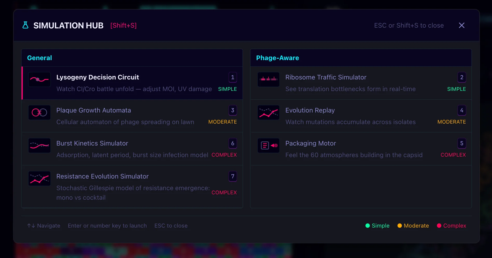

# Phage Explorer


A Terminal User Interface (TUI) for browsing, visualizing, and analyzing bacteriophage genetic data. Features color-coded DNA/amino acid sequences, rotating 3D ASCII phage models, and instant navigation between genomes—no browser, no cloud, just a fast local binary.

**One-liner install:**
```bash
curl -fsSL "https://raw.githubusercontent.com/Dicklesworthstone/phage_explorer/main/install.sh?$(date +%s)" | bash
```

---

## Screenshots

<p align="center">
  
  <br>
  <em>Main dashboard — Phage selector with 24 genomes, Lambda phage illustration, color-coded sequence grid, 3D protein structure viewer, and Analysis Tools panel</em>
</p>

<p align="center">
  
  <br>
  <em>Sequence + Structure view — Color-coded amino acid grid with gene map, alongside WebGL 3D protein structure (8ZVI, 28,618 atoms) fetched from RCSB PDB</em>
</p>

<p align="center">
  
  <br>
  <em>Virtual Gel Electrophoresis [Alt+G] — Simulate restriction enzyme digestion with EcoRI, HindIII, BamHI and more; compare predicted band patterns against experimental gels</em>
</p>

<p align="center">
  
  <br>
  <em>Simulation Hub [Shift+S] — Interactive phage biology simulations: Lysogeny Decision Circuit, Plaque Growth Automata, Ribosome Traffic, Burst Kinetics, and more</em>
</p>

---

## Phage 101 for engineers (why this field is wild)

**What phages are (in engineering terms):** self-assembling nanosyringes that package code (DNA/RNA) in a protein shell, land on bacteria, and inject that code to hijack the host. They’re the most abundant biological “edge devices” on Earth (≈10³¹ particles), continuously stress‑testing bacterial firmware.

### Why people study them
- *Medicine*: design phage cocktails to beat antibiotic‑resistant infections.
- *Biotech*: workhorse enzymes (T7 RNA polymerase, Phi29 DNA pol) are phage gifts used in PCR, in‑vitro transcription, and genome amplification.
- *Evolution & ecology*: phages rewrite bacterial genomes, drive the ocean carbon cycle, and shape your gut microbiome.
- *Engineering playground*: modular genomes swap parts (tail fibers, lysis cassettes) like microservice plugins.

### How phages cracked the genetic code
- **Hershey–Chase blender experiment (1952)** used phage T2 to prove DNA is the hereditary material.
- **Crick–Brenner frameshift experiment (1961)** in phage T4 rII genes showed the code is read in *triplets*—delete/insert three bases and the protein still works.
- **Early codon assignments** relied on phage RNA/DNA templates (e.g., poly‑U/UGG) to map base triplets to amino acids, paving the way for the 64‑codon table we use today.

---

- **What they are:** Bacteriophages (“phages”) are bacteria‑infecting viruses. They self‑assemble into nanomachines with a head (capsid) that stores DNA/RNA and a tail that injects it like a syringe.
- **Why they matter today**
  - *Medicine*: design phage cocktails to beat antibiotic‑resistant infections.
  - *Biotech*: workhorse enzymes (T7 RNA polymerase, Phi29 DNA pol) are phage gifts used in PCR, in‑vitro transcription, and genome amplification.
  - *Evolution & ecology*: phages are the most abundant biological entities on Earth. They rewrite bacterial genomes, drive the ocean carbon cycle, and shape your gut microbiome.
- **Modular by design:** Phage genomes behave like Lego kits—swapping tail fibers, lysis cassettes, and regulatory modules across lineages. That modularity is exactly what Phage Explorer visualizes.
- **Historical impact:** Foundational experiments (Hershey–Chase blender test for DNA as genetic material; Luria–Delbrück fluctuation test revealing random mutation) used phages. They were also the playground for cracking the genetic code.

### Quick mental model for software folks
- **Genome = source code** (A/C/G/T chars) with strongly typed 3-char opcodes (codons).
- **Promoter/RBS = function entry points** that recruit ribosomes (the runtime) to start decoding.
- **Reading frame = instruction pointer alignment;** shift by one base and every downstream opcode changes.
- **Stop codons = return;** terminate translation and hand control back to the host.
- **Phage lifecycle = deployment strategy:** lytic = `rm -rf host`; lysogenic = `git clone` into host genome and wait.

## A 90‑second genetic code primer

- DNA alphabet: A, C, G, T (RNA swaps T→U). Proteins are chains of 20 amino acids.
- Translation reads DNA in **codons**—non‑overlapping triplets of bases (64 possible combos). Every three letters → one amino acid or a stop signal.
- The mapping is fixed and mostly redundant (“degenerate”): several codons can encode the same amino acid. Three codons encode **stop**, and ATG usually marks **start**.
- Reading frames matter: shift by one base and every downstream codon changes. Phage Explorer lets you flip frames live to see amino acid strings reflow.
- Triplets are proven by phage genetics: three-base indels restore the reading frame; doublet/singlet changes scramble everything.
- Quick lookup:

| Codon | Amino acid | Notes |
|-------|------------|-------|
| ATG   | M (Methionine) | Start codon |
| TTT / TTC | F (Phenylalanine) | Aromatic |
| GAA / GAG | E (Glutamic acid) | Acidic |
| TGG | W (Tryptophan) | Unique single-codon amino acid |
| TAA / TAG / TGA | * (Stop) | Terminates translation |

- **Chemistry buckets:** Amino acids group into hydrophobic, polar, acidic, basic, and “special” (glycine, proline, cysteine, histidine). Themes color by these groups so chemical patterns pop while you scroll.

---

## Features

- **Full-Screen HUD Interface** — Navigate between phages instantly with arrow keys
- **Color-Coded Sequences** — DNA (ACTG) and amino acid views with distinct, beautiful colors
- **5 Color Themes** — Classic, Ocean, Matrix, Sunset, Forest (cycle with `T`)
- **3D Structure Viewer** — Real PDB structures from RCSB with cartoon/ball-and-stick/surface modes (web), ASCII wireframe (TUI)
- **Gene Map Navigation** — Visual gene bar with position tracking and snap-to-gene
- **Layer-1 Quick Overlays** — `G` GC skew, `X` complexity, `B` bendability, `P` promoter/RBS motifs, `R` repeats/palindromes
- **Diff Mode** — Compare sequences between phages visually
- **Search** — Fuzzy search by name, host, family, or accession
- **24 Real Phages** — Lambda, T4, T7, PhiX174, MS2, M13, P22, Phi29, Mu, Phi6, SPbeta, T5, P1, P2, N4, Felix O1, D29, L5, PhiC31, PhiKZ, PRD1, PM2, Qβ, T1
- **WASM-Accelerated** — Rust-compiled spatial algorithms for instant analysis of large structures
- **Zero Dependencies at Runtime** — Single binary, no Bun/Node required

---

## Quick Start

### Option 1: Pre-built Binary (Recommended)

```bash
# Install latest release (includes database)
curl -fsSL "https://raw.githubusercontent.com/Dicklesworthstone/phage_explorer/main/install.sh?$(date +%s)" | bash -s -- --with-database

# Run
phage-explorer
```

### Option 2: Build from Source

```bash
# Clone and install
git clone https://github.com/Dicklesworthstone/phage_explorer.git
cd phage_explorer
bun install

# Build the phage database (fetches from NCBI, ~1 minute)
bun run build:db

# Run the TUI
bun run dev
```

### Option 3: Web App

The full web experience is live at **https://phage-explorer.org**. It includes:

- **3D Structure Viewer** — Real PDB structures from RCSB with cartoon, ball-and-stick, and surface rendering modes
- **Interactive Sequence Grid** — Color-coded DNA/amino acid display with smooth scrolling
- **30+ Analysis Overlays** — GC skew, dot plots, Hilbert curves, HGT detection, synteny, and more
- **WASM-Accelerated** — Rust-compiled spatial algorithms for instant loading of large structures (50K+ atoms)
- **Mobile-Friendly** — Touch gestures, bottom sheets, haptic feedback

Deployment details:
- Hosting: Vercel (prod alias: `phage-explorer.org`)
- Build command: `bun run build:web`
- Output: `packages/web/dist`
- SQLite database bundled as static asset, queried via sql.js in-browser
- Zero telemetry, works offline after initial load

The **TUI** remains available for terminal enthusiasts:
- Local SQLite DB with instant queries
- ASCII 3D wireframe models
- Real-time keyboard controls, diff mode, command palette
- Build locally: `bun install && bun run build:db && bun run dev` (or use the prebuilt binary)

---

## Keyboard Controls

| Key | Action |
|-----|--------|
| `↑` / `↓` | Navigate between phages |
| `←` / `→` | Scroll sequence left/right |
| `PgUp` / `PgDn` | Scroll by one page |
| `Home` / `End` | Jump to start/end of genome |
| `N` / `C` | Toggle DNA / Amino Acid (codon) view |
| `F` | Cycle reading frame (1, 2, 3) |
| `T` | Cycle color theme |
| `D` | Toggle diff mode vs reference phage |
| `M` | Toggle 3D model display |
| `K` | Toggle amino acid key legend |
| `S` / `/` | Search phages |
| `[` / `]` | Jump to previous/next gene |
| `?` | Show help overlay |
| `Q` | Quit |

---

## Included Phages

| Phage | Genome | Type | Host | Notes |
|-------|--------|------|------|-------|
| **Lambda (λ)** | 48,502 bp | dsDNA | E. coli K-12 | Classic temperate phage, lysogenic |
| **T4** | 168,903 bp | dsDNA | E. coli B | Large lytic phage, contractile tail |
| **T7** | 39,937 bp | dsDNA | E. coli | Famous for its RNA polymerase |
| **PhiX174** | 5,386 bp | ssDNA | E. coli C | First DNA genome sequenced (1977) |
| **MS2** | 3,569 bp | ssRNA | E. coli | First genome ever sequenced (1976) |
| **M13** | 6,407 bp | ssDNA | E. coli | Filamentous, used in phage display |
| **P22** | 41,724 bp | dsDNA | Salmonella | Transducing phage |
| **Phi29** | 19,282 bp | dsDNA | B. subtilis | DNA polymerase for amplification |
| **Mu** | 36,717 bp | dsDNA | E. coli | Transposable phage |
| **Phi6** | 2,948 bp | dsRNA | P. syringae | Rare dsRNA phage with envelope |
| **SPbeta** | 134,416 bp | dsDNA | B. subtilis | Large temperate phage |
| **T5** | 121,750 bp | dsDNA | E. coli | Two-step DNA injection |
| **P1** | 94,800 bp | dsDNA | E. coli | Plasmid prophage, Cre-lox origin |
| **P2** | 33,593 bp | dsDNA | E. coli | Founding Peduovirus |
| **N4** | 70,153 bp | dsDNA | E. coli | Injects its own RNA polymerase |
| **Felix O1** | 86,155 bp | dsDNA | Salmonella | Classic Salmonella-typing phage |
| **D29** | 49,136 bp | dsDNA | Mycobacterium | SEA-PHAGES workhorse, TB research |
| **L5** | 52,297 bp | dsDNA | Mycobacterium | First sequenced mycobacteriophage |
| **PhiC31** | 41,491 bp | dsDNA | Streptomyces | Serine integrase for gene therapy |
| **PhiKZ** | 280,334 bp | dsDNA | Pseudomonas | Jumbo phage, forms nucleus-like shell |
| **PRD1** | 14,927 bp | dsDNA | E. coli | Tailless, internal lipid membrane |
| **PM2** | 10,079 bp | dsDNA | Pseudoalteromonas | Marine, first lipid-containing phage |
| **Qβ** | 4,217 bp | ssRNA | E. coli | RNA replicase, isothermal amplification |
| **T1** | 48,836 bp | dsDNA | E. coli | Notorious lab contaminant |

---

## Color Themes

Cycle through themes with `T`:

- **Classic** — Traditional bioinformatics colors (green A, blue C, amber G, red T)
- **Ocean** — Cool blue/teal palette
- **Matrix** — Green terminal aesthetic
- **Sunset** — Warm orange/coral tones
- **Forest** — Natural earth greens and browns

Each theme provides distinct colors for:
- 4 nucleotides (A, C, G, T) + N
- 20 amino acids grouped by property (hydrophobic, polar, acidic, basic, special) + stop codon

---

## Architecture

```
phage-explorer/
├── packages/
│   ├── core/           # Domain logic: codons, theming, grid virtualization
│   ├── db-schema/      # Drizzle ORM schema (phages, sequences, genes, etc.)
│   ├── db-runtime/     # Repository implementations over SQLite
│   ├── state/          # Zustand store for UI state management
│   ├── renderer-3d/    # ASCII 3D rendering engine with Z-buffering
│   ├── wasm-compute/   # Rust/WASM for performance-critical algorithms
│   ├── data-pipeline/  # NCBI fetcher and database builder
│   ├── web/            # React web app with WebGL 3D viewer
│   └── tui/            # Ink/React TUI components
├── phage.db            # SQLite database (generated)
└── install.sh          # One-liner installer script
```

---

## UI Design System

To keep 31+ planned features coherent, Phage Explorer follows a lightweight design system tailored for text UIs:

- **Color semantics**  
  - Green `#22c55e`: good / conserved / similar  
  - Yellow `#eab308`: caution / neutral  
  - Red `#ef4444`: warning / divergent  
  - Blue `#3b82f6`: informational metrics  
  - Purple `#a855f7`: notable / special  
  - Gray `#6b7280`: background / reference / inactive

- **Graph & sparkline standards**  
  - Height: 3–5 text rows; Width: terminal width where possible  
  - Auto-normalize values; show min/max in labels  
  - Prefer Braille dots for dense sparklines; fall back to ASCII if needed

- **Panels, modals, overlays**  
  - Single-line box borders, 1-char padding  
  - Headers bold, centered, include close hint (e.g., “Esc to close”)  
  - Max width 80 chars or `(terminal width - 4)`, whichever is smaller

- **Interaction “depth layers” (progressive disclosure)**  
  - Layer 0: Core always-on controls (navigation, view toggles, help, search)  
  - Layer 1: Quick overlays (single-key toggles; limit 3 active)  
  - Layer 2: Analysis menu (`A`) with numbered shortcuts + fuzzy search  
  - Layer 3: Simulation hub (`Shift+S`) for interactive models  
  - Layer 4: Command palette (`:` or `Ctrl+P`) that fuzzy-searches all actions

Use these conventions for any new component: pick colors from the palette above, respect padding/borders, and place advanced features in deeper layers so newcomers see a stable core UI.

---

## Depth Layers & Keybinding Conventions (progressive disclosure)

Phage Explorer serves both newcomers and power users by stacking features in “depth layers”:

- **Layer 0 – Sacred Surface (always available, never changed)**  
  Navigation: `↑` `↓` `←` `→` `PgUp` `PgDn` `Home` `End`  
  View: `N`/`C`/`Space` (DNA/AA), `F` (frame), `T` (theme), `D` (diff), `M` (3D model)  
  Meta: `?` (help), `S` or `/` (search), `Q` (quit)  
  These keys are stable forever; everything else builds on top.

- **Layer 1 – Quick Overlays (single-key toggles; max 3 active)**  
  Reserved keys: `G` (GC skew), `X` (complexity), `B` (bendability), `P` (promoter/RBS), `R` (repeats).  
  Data is precomputed on phage selection so toggles feel instant. (Feature hooks coming next.)

- **Layer 2 – Analysis Menu (`A`)**  
  Categorized, numbered actions (e.g., GC skew analysis, dot plots, codon dashboards). Supports fuzzy search.

- **Layer 3 – Simulation Hub (`Shift+S`)**  
  Full-screen interactive simulations (lysogeny circuits, ribosome traffic, plaque automata, etc.).

- **Layer 4 – Command Palette (`:` or `Ctrl+P`)**  
  Fuzzy-search every action; shows the shortcut path (e.g., “GC skew [G] Overlay” or “Dot plot [A→4] Analysis”).

Keystroke budget rule: Layer 0 keys are immutable; new features must live in higher layers. This keeps discoverability for beginners and speed for experts.

---

## Installation Options

### Installer Flags

```bash
# Install to custom directory
curl -fsSL .../install.sh | bash -s -- --dest ~/bin

# Install system-wide
curl -fsSL .../install.sh | bash -s -- --system

# Install specific version
curl -fsSL .../install.sh | bash -s -- --version v1.0.0

# Build from source instead of downloading binary
curl -fsSL .../install.sh | bash -s -- --from-source

# Include phage database
curl -fsSL .../install.sh | bash -s -- --with-database

# Auto-add to PATH
curl -fsSL .../install.sh | bash -s -- --easy-mode
```

### Environment Variables

| Variable | Default | Description |
|----------|---------|-------------|
| `VERSION` | latest | Pin specific release tag |
| `DEST` | `~/.local/bin` | Install directory |
| `OWNER` | `Dicklesworthstone` | GitHub owner |
| `REPO` | `phage_explorer` | GitHub repository |

---

## Scripts Reference

| Script | Description |
|--------|-------------|
| `bun run dev` | Run TUI in development mode |
| `bun run build:db` | Build phage database from NCBI |
| `bun run build` | Compile to single binary |
| `bun run build:all` | Build for all platforms |
| `bun run lint` | ESLint (zero warnings) |
| `bun run typecheck` | TypeScript checks |
| `bun run check` | Lint + typecheck |
| `bun run test` | Run unit tests |

---

## Technical Details

- **Sequence Storage**: Chunked in 10kb segments for efficient virtualized rendering
- **Virtualized Rendering**: Only visible sequence portion rendered, smooth 60fps scrolling
- **3D Engine**: Custom ASCII renderer (TUI) and WebGL/Three.js viewer (web) with real PDB structures
- **WASM Acceleration**: Rust-compiled WebAssembly for compute-intensive operations (spatial-hash bond detection, dot plots, k-mer analysis) with automatic JS fallback
- **3D Structure Loading**: Fetches PDB/mmCIF from RCSB, parses in Web Worker, O(N) spatial-hash bond detection for structures with 50,000+ atoms
- **State Management**: Zustand for reactive UI updates
- **Database**: SQLite with Drizzle ORM, ~6MB for 24 phages with PDB structure references

---

## Troubleshooting

| Issue | Solution |
|-------|----------|
| Database missing | Run `bun run build:db` or use `--with-database` flag |
| NCBI fetch errors | Retry `build:db`; NCBI has rate limits |
| Binary not in PATH | Use `--easy-mode` or manually add install directory |
| Terminal too small | Resize to at least 80x24 for best experience |
| Colors not showing | Ensure terminal supports 256 colors / truecolor |

---

## Security & Privacy

- **Network calls**: Only to NCBI during database build
- **No telemetry**: Zero analytics or tracking
- **Local data**: All data stored in local SQLite database
- **Open source**: Full source code available for audit

---

## Performance Notes

- Single-binary distribution, no runtime dependencies
- SQLite database for instant local queries
- Virtualized sequence rendering for genomes up to 500kb+
- Chunked fetching avoids loading entire genomes into memory
- 3D model rendering at ~20fps with minimal CPU usage
- **WASM spatial-hash**: O(N) bond detection vs O(N²) naive—1000x faster for large structures (50K atoms: <1s vs 60s+)
- Web Worker isolation keeps UI responsive during heavy computation
- Automatic fallback to pure JS when WASM unavailable

---

## CI/CD

- **Lint + Typecheck**: Every push and PR
- **Cross-platform builds**: macOS (arm64, x64), Linux (x64, arm64), Windows (x64)
- **Automated releases**: Tagged versions trigger binary builds and GitHub release
- **Database artifacts**: Pre-built `phage.db` included in releases

---

## Development

1. `bun install` to set up dependencies
2. `bun run build:db` to create the database
3. `bun run dev` to run the TUI
4. Run `bun run check` before committing changes

---

## License

MIT License - see [LICENSE](LICENSE) for details.

---

## Acknowledgments

- Sequence data from [NCBI GenBank/RefSeq](https://www.ncbi.nlm.nih.gov/)
- TUI framework: [Ink](https://github.com/vadimdemedes/ink) (React for CLIs)
- Database: [Drizzle ORM](https://orm.drizzle.team/) + SQLite
- Runtime: [Bun](https://bun.sh/)
